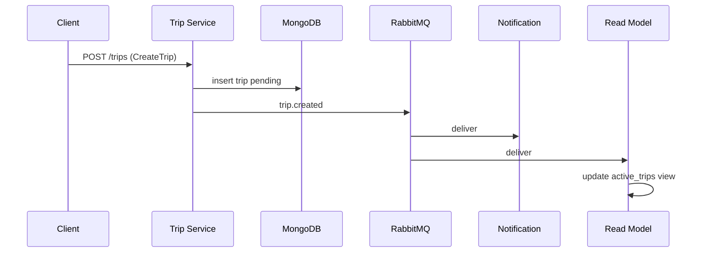

# Event-Driven архитектура — сервис заказа поездок

Вариант: **заказ поездок** (тот же домен, что в ДЗ №4–5 и `2026_prog_inja`).  
Сущности: пользователи, водители, поездки (`pending` → `active` → `completed`).

## 1. События и команды

| Команда (write) | Сервис-инициатор | Событие | Кого уведомить |
|-----------------|------------------|---------|----------------|
| `RegisterUser` | User Service | `user.registered` | Notification, Analytics |
| `RegisterDriver` | Driver Service | `driver.registered` | Notification, Trip (доступность водителя) |
| `CreateTrip` | Trip Service | `trip.created` | Notification, Read Model, Cache |
| `AcceptTrip` | Trip Service | `trip.accepted` | Notification, Read Model, Cache |
| `CompleteTrip` | Trip Service | `trip.completed` | Notification, Read Model, Analytics, Cache |

Запросы (read), событий не порождают: `GetUserByLogin`, `SearchUsers`, `ListActiveTrips`, `GetTripHistory`.

## 2. Компоненты

**Producers (публикуют в брокер после успешной записи в БД):**

- User Service — `user.registered`
- Driver Service — `driver.registered`
- Trip Service — `trip.created`, `trip.accepted`, `trip.completed`

**Consumers:**

| Consumer | Очередь | Назначение |
|----------|---------|------------|
| Notification Service | `taxi.notifications` | push/SMS/email заглушка |
| Read Model Service | `taxi.readmodel` | проекция активных поездок (CQRS read) |
| Cache Service | `taxi.cache` | инвалидация Redis-ключей (`trips:active`) |

## 3. Поток событий



Аналогично для `accept` / `complete`: команда → транзакция в write-модели → публикация события → асинхронное обновление read-модели и кеша.

## 4. Брокер: RabbitMQ

**Выбор:** RabbitMQ — маршрутизация по типу события через topic exchange, отдельные очереди на bounded context потребителей.

| Параметр | Значение |
|----------|----------|
| Exchange | `taxi.events`, type **topic**, durable |
| Routing key | = `event_type` (`trip.created`, `trip.accepted`, …) |
| Очереди | см. `QUEUE_BINDINGS` в `src/lib/broker.py` |

**Формат сообщения (JSON):**

```json
{
  "event_id": "uuid",
  "event_type": "trip.created",
  "occurred_at": "2026-05-24T12:00:00Z",
  "version": 1,
  "payload": { "trip_id": "...", "user_id": "...", "status": "pending" }
}
```

AMQP properties: `delivery_mode=2`, `content_type=application/json`, `message_id=event_id`, `type=event_type`.

**Гарантии доставки:** **at-least-once**

- durable exchange и очереди;
- persistent messages (`delivery_mode=2`);
- publisher с `mandatory=true` (нет маршрута — ошибка);
- consumer с **manual ack** после обработки;
- при сбое — `basic_nack` + `requeue`.

Exactly-once в распределённой системе не гарантируется без idempotent consumer и dedup по `event_id` (outbox + inbox). Для учебного сервиса достаточно at-least-once и идемпотентной обработки по `event_id`.

## 5. CQRS

**Применим:** да.

| Сторона | Хранилище | Операции |
|---------|-----------|----------|
| Write | MongoDB `trips`, `users` | команды создания/смены статуса |
| Read | проекция `active_trips` (файл `data/read_model.json` в демо; в проде — Redis/отдельная коллекция) | `ListActiveTrips` без тяжёлых join |

Синхронизация: Trip Service пишет истину в MongoDB и публикует событие; Read Model Service подписан на `trip.#` и обновляет проекцию. Задержка eventual consistency допустима для списка активных заказов (как в ДЗ №5 с TTL кеша).

Команды не читают read-модель; запросы не пишут в write-модель напрямую через события.

## 6. Реализация в репозитории

- `src/lib/broker.py` — топология, publish, consume
- `src/bin/producer.py` — публикация тестовых событий
- `src/bin/consumer.py` — потребитель (`notifications` | `readmodel` | `cache`)
- `docker-compose.yml` — RabbitMQ + Management UI

Подробный каталог событий: [`event_catalog.md`](event_catalog.md).
